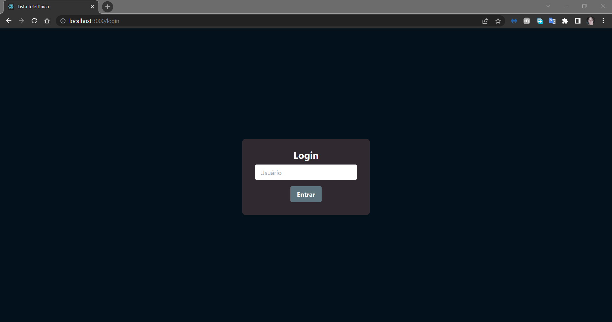
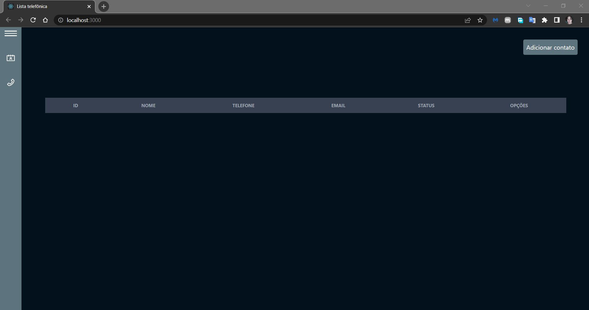
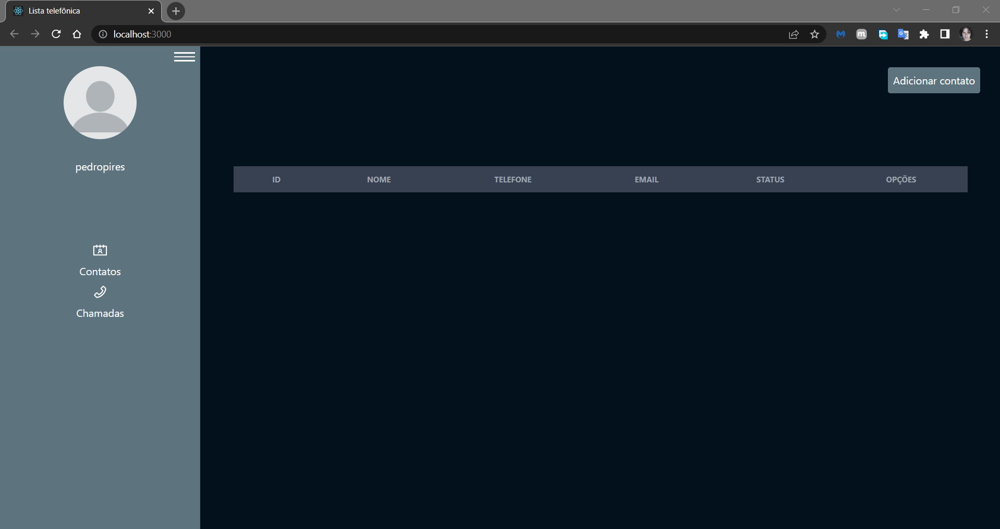
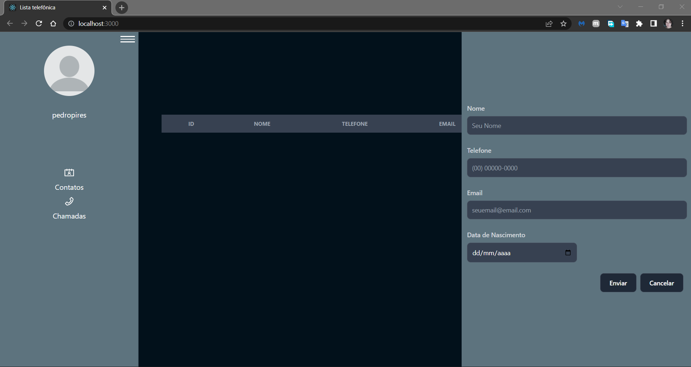
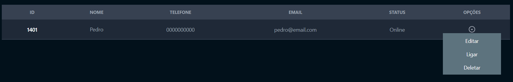
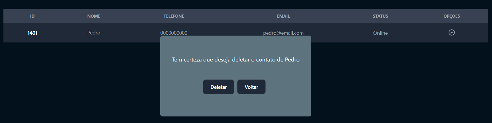
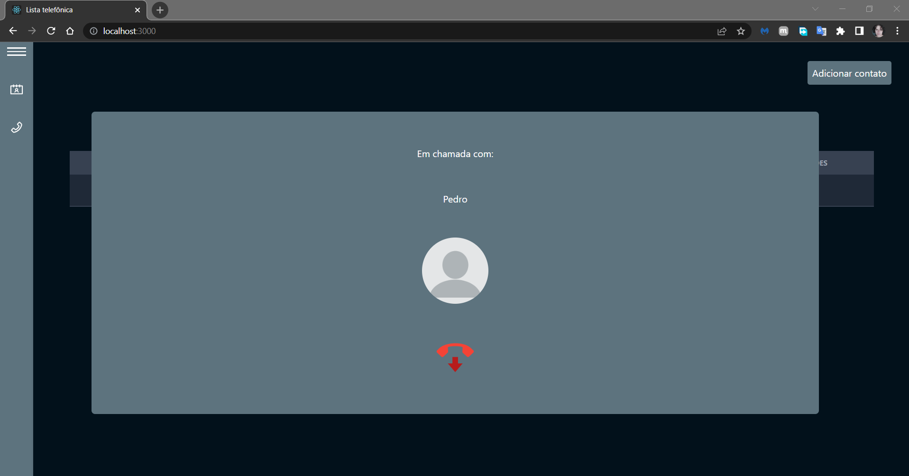
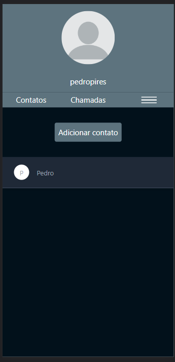

# teste-estagio-box3

## Objetivo
Esse código foi criado para cumprir o teste para a vaga de estágio na Box3, uma software house que presta serviços de desenvolvimento de software para outras empresas.  

## Fase 1
A primeira fase desse projeto foi criar o código inteiro, que consiste em consumir uma API da Box3. É um crud simpes, apenas criar contatos, editar, excluir e listar os contatos de um determinado usuário. O código do primeiro commit está completo, bastando completar o campo token, no arquivo scripts/api.js. O restante já está funcional.  

## Fase 2
Nas próximas fases que seguem, foi proposto uma melhoria para o projeto, onde é possível realizar ligações de acordo com os contatos. O objetivo aqui é expandir e melhorar o visual da aplicação.  

## Fase 2 - Concluída.
A conculsão da fase 2 resultou em uma aplicação em React.js que consome a mesma API utilizando Axios. Nela é possível fazer as mesmas coisas da fase 1 e novas funcionalidades, como simular uma ligação para um cliente.   

# Atenção: removi o link da API para a qual o projeto foi feito. Ou seja, clonar o repositório e rodar localmente não irá funcionar.

## Imagens

  

 

